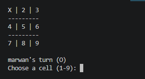

#  Tic-Tac-Toe Game

A simple console-based Tic-Tac-Toe game built with **Python** using **Object-Oriented Programming (OOP)** principles.

---

##  Features

-  Two-player gameplay
-  Input validation
-  Win detection
-  Draw detection
-  Restart game

---

##  Project Structure

```
Tic-Tac-Toe/
│── main.py
│── game.py
│── board.py
│── player.py
│── menu.py
│── README.md
└── images/
    └── gameplay.png
```

---

## 🚀 How to Run

Clone the repository:

```bash
git clone https://github.com/marwan68/Tic-Tac-Toe.git
```

Go to the project folder:

```bash
cd Tic-Tac-Toe
```

Run the game:

```bash
python main.py
```

---

## 📸 Screenshot



---


